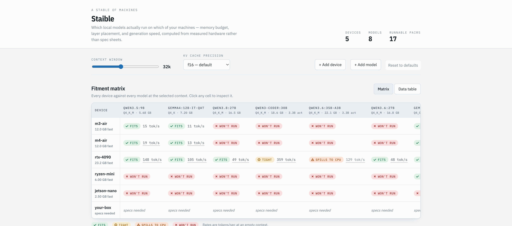
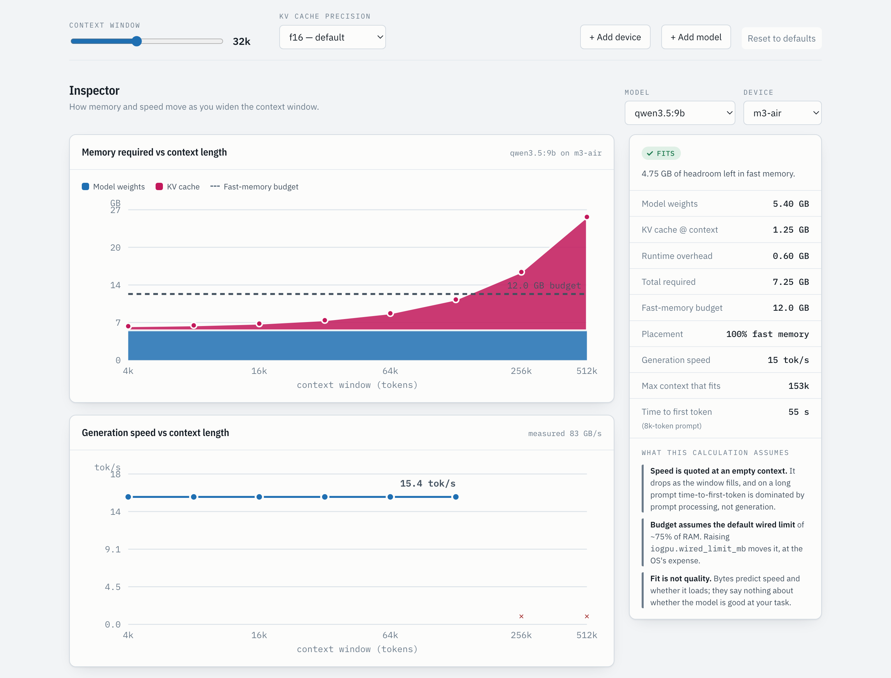
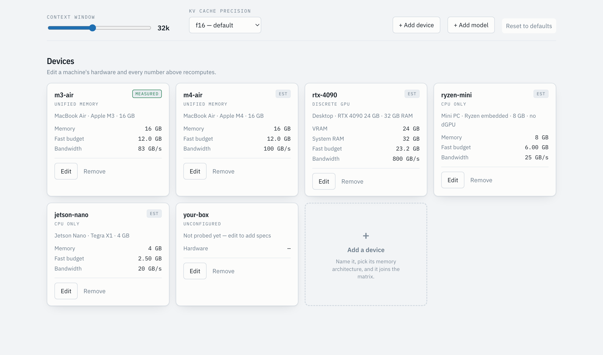

# Staible

[](https://github.com/DTreg1/Staible/actions/workflows/ci.yml)
[](LICENSE)
[](#tests)

**A stable of machines, and which local LLMs actually run in it.**

**[Try it live](https://dtreg1.github.io/Staible/)** · no install, runs entirely in your browser

Staible answers one question: *given this model and this machine, will it run, and
will it be usable?* It is built for a heterogeneous fleet — Apple Silicon laptops, a
discrete-GPU box, a couple of SBCs — where the generic "VRAM calculator" answer is
wrong for most of the hardware.

The tool is a single self-contained HTML file. No build step, no dependencies, no
server, no telemetry. Open it and it works.



## Why not just use a VRAM calculator

Every calculator worth using takes hardware specs as *input*, and nearly all of them
assume one discrete GPU with separate VRAM and system RAM. That assumption produces
two specific errors on a mixed fleet.

**Spilling is not one behaviour.** When layers don't fit in fast memory they land on
the CPU. On Apple Silicon those layers read the *same physical RAM*; on a discrete GPU
the work crosses PCIe. Both cases were measured:

| Machine | Layers on CPU | Speed retained |
|---|---|---|
| M3 Air, qwen3.5:9b | 45% | 90% (15.4 → 13.9 tok/s) |
| RTX 4090, qwen3-coder:30b | 29% | 48% (172.5 → 83.0 tok/s) |

The 4090 loses five times as much speed while displacing *fewer* layers — roughly
eight times the cost per displaced layer. Staible models the two as separate pools
blended harmonically, with each slow-pool bandwidth solved from its measurement
(0.81 and 0.21 of the fast pool), so one formula reproduces both.

**Download size is the floor, not the total.** The GGUF file is the weights, all of
which must be resident. On top sit the KV cache — allocated up front — and runtime
overhead. A 17 GB model on a 16 GB machine was never going to run, but neither is a
13 GB one at 128k context.

## What it shows

Pick a context length and every cell recomputes. Click any cell to inspect that pair.



The right-hand column ends with **what the calculation assumes** — which inputs were
measured, which were extrapolated, and where the model is known to be weak. Nothing
here is presented as more certain than it is.

Devices and models are editable, and the dashed tiles add new ones.



### Adding hardware

You should not have to know your machine's memory bandwidth in GB/s. Pick the chip or
GPU and Staible fills in the architecture, VRAM and bandwidth from the published spec.


Presets cover Apple Silicon M1–M4 (base through Ultra — the tier matters enormously,
spanning roughly 68 to 800 GB/s), GeForce RTX 30/40/50, NVIDIA datacentre parts,
Radeon RX, Intel Arc, and common DDR4/DDR5 channel configurations. Anything not listed
can still be entered by hand.

Published peak bandwidth is derated by 0.82 to an effective figure. That factor is
anchored to the only measurement available — an M3 with a 100 GB/s published figure
sustained 83 GB/s — and it holds up: the M3 preset derives 82 GB/s and 148 prompt tok/s
against 83 and 149 measured. One data point is not a validation set, so presets are
always flagged `est` and a measured value should replace them.

## The model

Generation is memory-bandwidth bound: producing a token requires reading every
*active* weight. So

```
tok/s  ≈  effective bandwidth  ÷  active weight bytes
```

where **effective bandwidth** blends the fast and slow pools by the fraction of layers
in each — `1 / (fastFrac/bwFast + cpuFrac/bwSlow)` — and **active** means active
parameters, not total. A 30B MoE with 3.3B active occupies memory like a 30B and
generates like a small dense model.

Context costs memory linearly (for most architectures — see below) and latency worse
than that. Measured on an M3: KV cache grew ~40 MB per 1k tokens for a 9B Qwen, so
262k context cost 10.5 GB on top of a 5.4 GB model. But *declaring* a large context is
cheap and *filling* it is not — feeding 9,018 real tokens took 60 s of prompt
processing before the first output token, while generation barely moved.

## Measured vs estimated

The distinction is load-bearing, so the UI never blurs it. Every value is tagged.

| Constant | Value | Source |
|---|---|---|
| M3 Air effective bandwidth | 83 GB/s | measured — 5.4 GB weights at 15.4 tok/s |
| qwen3.5:9b KV cache | 40 MB / 1k tokens | measured — resident size across a `num_ctx` sweep |
| gemma4:12b-it-qat KV cache | 3.1 MB / 1k tokens | measured |
| gemma4:12b-it-qat bandwidth | 89.3 GB/s | measured — independent confirmation of the M3 figure |
| M3 Air prompt processing | 149 tok/s | measured |
| qwen3-coder:30b KV cache | 105.6 MB / 1k tokens | measured on the 4090 |
| RTX 4090 prompt processing | 10,201 tok/s | measured |
| unified spill penalty | slow pool = 0.81 × fast | solved from the M3 measurement |
| discrete spill penalty | slow pool = 0.21 × fast | solved from the 4090 measurement |
| everything else | vendor figures and extrapolation | estimated |

### The estimates fail by architecture, and badly

Extrapolating KV cost from parameter count assumes every layer keeps a full cache.
Sliding-window models cap it instead. `gemma4:12b-it-qat` was **estimated at 48 MB per
1k tokens and measured at 3.1** — a 15-fold error, with resident size essentially flat
from 4k to 131k context.

That is the single best argument for `measure-device.sh`. Anything not tagged
`measured` can be wrong by an order of magnitude, and the tool says so on every
affected calculation.

## Layout

```
index.html                   the tool — open it directly, no build
scripts/probe-fleet.sh       SSH hardware inventory -> data/fleet.json
scripts/measure-device.sh    Ollama measurement harness -> bandwidth, KV, prompt rate
scripts/fetch-hf-catalog.py  Hugging Face GGUF specs -> data/hf-catalog.json
scripts/check-selfcontained.py  CI guard: the page must stay dependency-free
test/run.mjs                 the test suite (node test/run.mjs)
data/fleet.example.json      example inventory (your own fleet.json is gitignored)
data/hf-catalog.json         fetched model catalog
```

## Use

```bash
git clone https://github.com/DTreg1/Staible.git && cd Staible
open index.html              # or xdg-open / just open the file in a browser
```

That's enough to try it — the page ships with an example fleet and a real model
catalog. To point it at your own hardware:

```bash
# 1. inventory your machines (SSH aliases; unreachable hosts are recorded as
#    unknown rather than guessed at)
./scripts/probe-fleet.sh my-laptop my-desktop my-pi > data/fleet.json

# 2. replace estimates with observations on any machine running Ollama
./scripts/measure-device.sh qwen3.5:9b
OLLAMA_HOST=http://desktop:11434 ./scripts/measure-device.sh qwen3-coder:30b

# 3. refresh the model catalog from Hugging Face
./scripts/fetch-hf-catalog.py --top 20 > data/hf-catalog.json
./scripts/fetch-hf-catalog.py unsloth/Qwen3.5-9B-GGUF
```

Devices and models edited in the page persist to `localStorage`; **Reset to defaults**
restores the baseline compiled into the file.

### Importing a model from Hugging Face

`scripts/fetch-hf-catalog.py` reads the HF API directly. Inside the page — which runs
sandboxed and cannot call external hosts — the importer is a deliberate round trip:
enter a repo id, press **Open** to load the API response in a new tab, paste it back,
press **Read specs**.

Either path sums split shards, excludes `mmproj` vision projectors, sanity-checks each
quantisation's file size against the parameter count, and flags MoE repos so you set
active parameters yourself — the API does not report them.

## Limits

Read these before betting a download on the output. The page carries the same list.

- **Speed is treated as purely bandwidth-bound.** True for single-stream local
  inference; breaks down for batched serving or where compute is the real ceiling.
- **One bandwidth number per device.** Real machines vary by access pattern and
  thermal state. Treat every tok/s as a ceiling, not a promise.
- **Placement is predicted, not observed.** The runtime decides for real and may keep
  more or fewer layers resident, especially near the boundary.
- **The two spill constants each rest on a single measurement**, one machine apiece.
  The gap between them is large and reproducible; the precise values are the least
  certain numbers in the tool.
- **Runtime overhead is a flat 0.6 GB allowance** — the least defensible constant here.
- **Fit is not capability.** A model that fits comfortably may still be worse at your
  task than one that barely runs. Quantisation trades quality for size in ways no
  number on this page captures.

## Contributing

Useful contributions, roughly in order of value:

1. **Measured constants for hardware in the preset list.** Every preset is a derated
   spec sheet; only the M3 has been checked against reality. Run `measure-device.sh`
   and open a PR replacing the estimate — that is the single most valuable thing you
   can contribute, and it directly tests whether the 0.82 derate generalises.
2. **Presets for hardware not listed** — the catalogue is a plain object near the top
   of the script in `index.html`. Add a row, cite the published bandwidth.
3. **Measured KV costs**, especially for architectures that deviate from the
   parameter-count curve the way sliding-window models do.
4. **A better KV estimator.** The current `40 × (params/8.95)^0.65` is a placeholder
   anchored to one measurement and is known to be wrong across architecture families.

The tool is deliberately one HTML file with no build step, and the test suite has no
dependencies. Please keep both that way — CI enforces the first.

Run `node test/run.mjs` before opening a PR.

## Tests

```bash
node test/run.mjs
```

No dependencies and no install step — the suite loads `index.html`'s script into a
stubbed DOM and exercises the engine directly, so the single-file design stays intact.
40 assertions covering:

- **`budget`** — that architecture, not capacity, decides the memory model
- **The central claim** — that a spill costs little on unified memory and collapses
  across PCIe. If those two ever converge, the tool has lost its reason to exist, and
  three tests fail
- **MoE** — memory tracks total parameters, speed tracks active
- **`parseHF`** — split shards summed, `mmproj` projectors excluded, implausible file
  sizes rejected. Each of these is a real bug caught during development, pinned
- **Presets** — the M3 preset must keep reproducing the machine it was derived from
  (83 GB/s, 149 prompt tok/s). It is the only check on the 0.82 derate factor
- **Shipped defaults** — that the catalogue the docs describe still behaves as described

The suite is mutation-tested: drifting the derate factor, treating a discrete spill like
a unified one, dropping the `mmproj` filter, overwriting shards instead of summing them,
using total parameters for MoE speed, and removing the wired-limit reserve are each
caught by at least one assertion.

CI runs the suite plus a lint pass on every push and pull request — shell scripts parse,
Python compiles, the page's script parses, shipped JSON is valid, README images exist,
and `index.html` has not quietly acquired an external dependency.

## Sources and acknowledgements

Staible is an independent project. It is **not affiliated with, endorsed by, or
sponsored by** any of the organisations below. All trademarks belong to their owners
and are used here only to identify the hardware and software the tool reasons about.

- **[Hugging Face](https://huggingface.co)** — model metadata (parameter counts, trained
  context, per-quantisation file sizes) is read from their public API. Please be
  considerate with request volume; `fetch-hf-catalog.py` honours an optional `HF_TOKEN`
  environment variable if you have one and need higher rate limits.
- **GGUF publishers** whose repositories make up the default catalogue —
  [unsloth](https://huggingface.co/unsloth), [ggml-org](https://huggingface.co/ggml-org),
  and [LiquidAI](https://huggingface.co/LiquidAI) — and the model authors behind them,
  including Alibaba (Qwen), Google (Gemma) and Liquid AI.
- **[llama.cpp](https://github.com/ggml-org/llama.cpp)** — the GGUF format, and the
  layer-offloading behaviour this tool models.
- **[Ollama](https://ollama.com)** — `measure-device.sh` drives its local API to take
  measurements.
- **Apple, NVIDIA, AMD and Intel** — the hardware presets use each vendor's published
  memory-bandwidth figures, derated. Those numbers are the vendors’; any error in
  applying them is this project’s.
- **[IBM Plex](https://github.com/IBM/plex)** by IBM, licensed under the
  [SIL Open Font License 1.1](https://openfontlicense.org), served via Google Fonts.

## License

MIT — see [LICENSE](LICENSE). This covers Staible’s own code and documentation. Model
weights, vendor specifications and the typeface carry their own separate licences.
